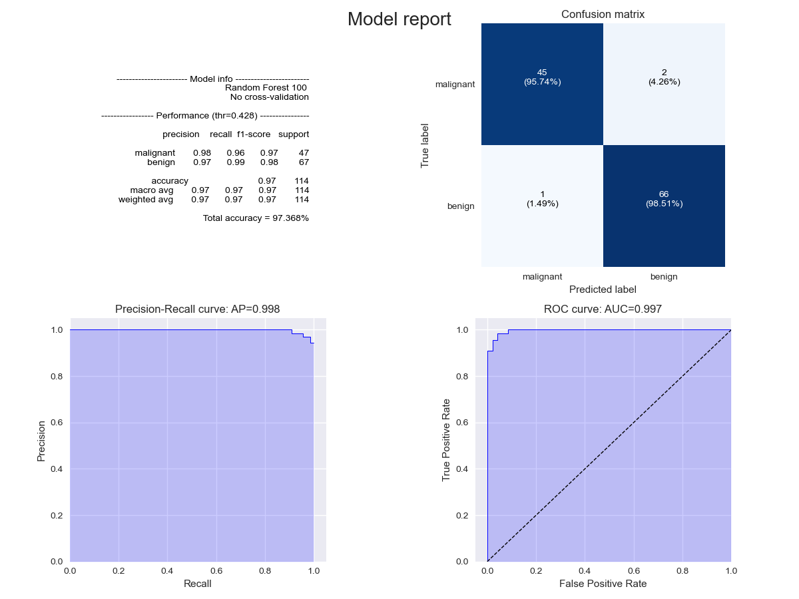
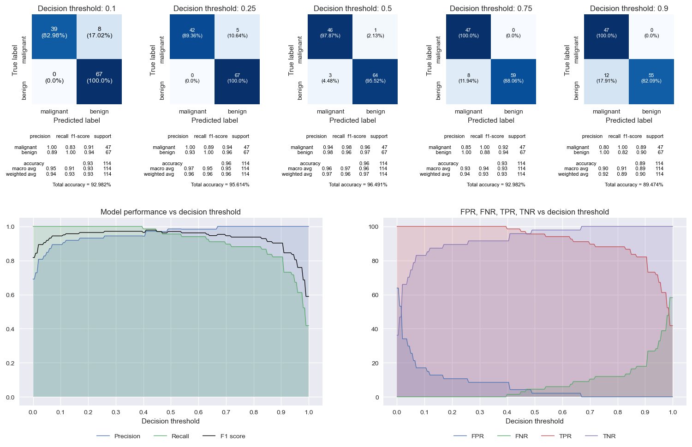

# ML-reporting-tools
Library of functions for generating visually pleasing performance reports for Machine Learning models.

# Example reports:



# Functions:
  contains:
- **plot_confusion_matrix()**: Generates an aesthetic confusion matrix (either standalone or within another figure).
- **plot_precision_recall_curve()**: Generates an aesthetic Precision-Recall curve (either standalone or within another figure).
- **plot_roc_curve()**: Generates an aesthetic ROC curve (either standalone or within another figure).
- **estimate_best_threshold()**: Estimates the "best" threshold for a binary classifier, one that results in the maximum F1 score. 
- **generate_threshold_report()**: Generates a detailed threshold analysis for a binary classifier. 
- **generate_classification_report()**: Generates a detailed report for a classifier.


# Contents:
```tree
├── source                                  [Directory: Source code]
│   ├── ml_reporting_tools.py               [Main script with all the functions]  
│   ├── example_2_class_classification.py   [Example for a binary classifier]  
│   └── example_3_class_classification.py   [Example for a multiclass classifier]
└── images                                  [Directory: Sample reports]
```

# Dependences
- numpy
- sklearn
- matplotlib
